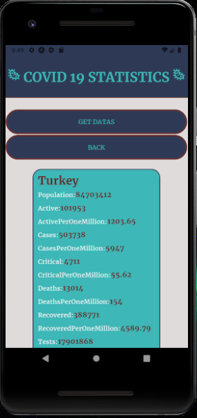
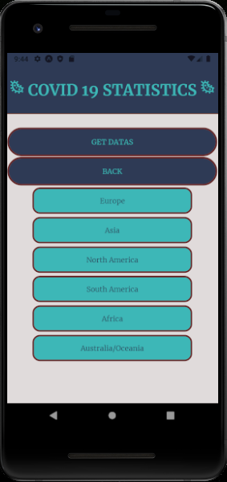
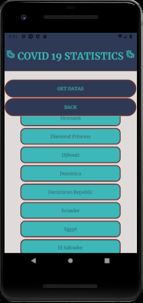

# ReactNative-Covid19Statistics
This is a not entirely finished ReactNative application about getting COVID19 statistics from API. User can see spesific continent or country infos by selecting them.

#
 
 
 

